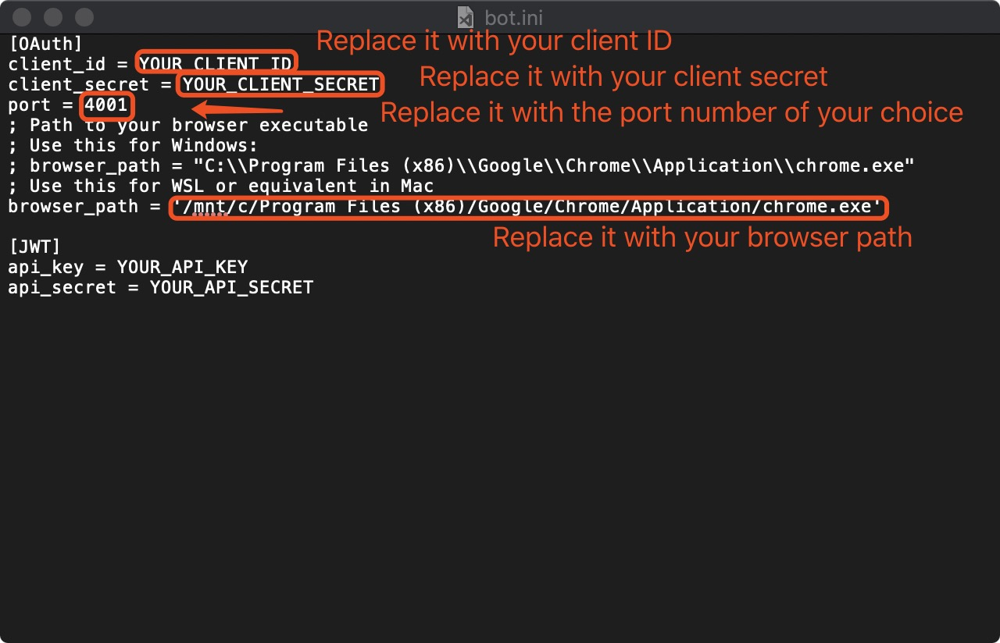
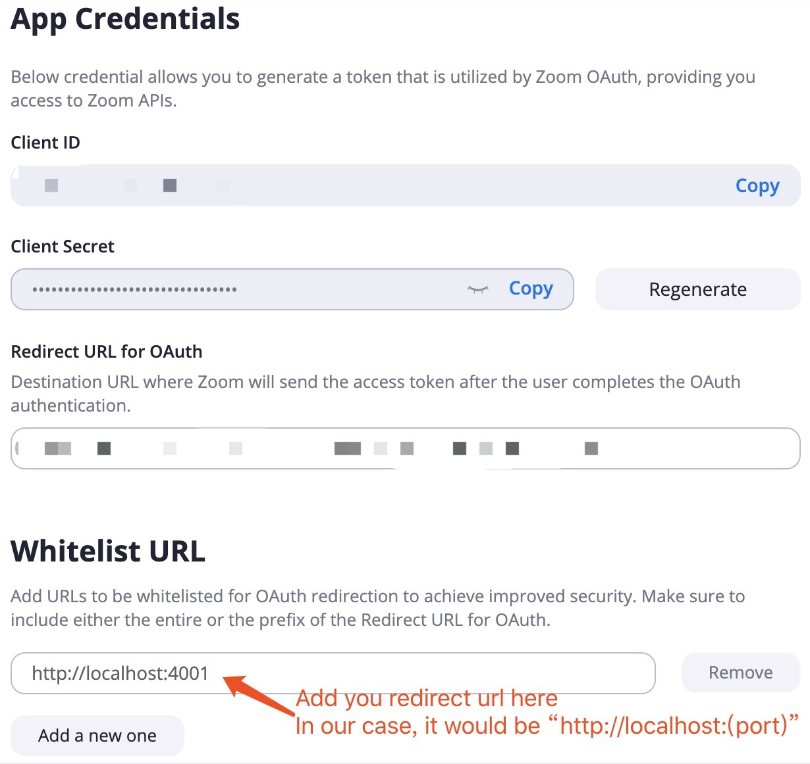

#Setup Instruction
##Build the Project (with IntelliJ)
1. Open IntelliJ. 
2. Click "File" -> "New" -> "Project from Existing Sources...".
3. Find and open the project folder "262P_ZoomApiInJava".
4. Choose "Import project from external model" - Maven.

##Configuration
The configuration file is bot.ini. Its path from the content root is src/main/java/bots/bot.ini. To make it work, follow the instructions below in the screenshot.

##Run the Bot
1. Find "MyOAuthBot". Its path from the content root is src/main/java/bots/MyOAuthBot.java.
2. Run the main method of MyOAuthBot to execute all testing calls for ChatChannels and ChatMessages.

##Potential Running Issue
When running the bot, it is possible to meet the invalid redirect url issue. A feasible solution is to add your redirect url to the whitelist in your Zoom app profile.

##Unreliable Code
The join method in ChatChannels is not reliable. When running the OAuthBot, it will trigger an exception: "java.lang.IllegalArgumentException: method POST must have a request body", because the request body shouldn't be null for HTTP POST. However, the code example on the Zoom API website does so. Currently I don't know how to solve the issue but I put the join test statement at the end of all testing calls so it will be executed after any other statements. You can also comment it to avoid the exception.
